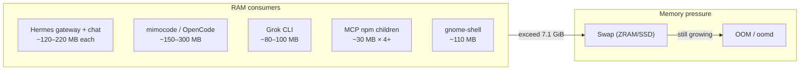

# System, OOM & Linux Optimization Guide

**Ubuntu 26.04 LTS (resolute) · ThinkPad X1 Carbon 4th Gen · 8 GB RAM**

Step-by-step documentation for surviving AI agent workloads on a memory-constrained Linux desktop — kernel tuning, ZRAM, OOM protection, service hygiene, and agent lifecycle management.

| Host | User | RAM | Swap | Kernel tuning | OOM guard |
|------|------|-----|------|---------------|-----------|
| x1-ThinkPad-X1-Carbon-4th | x2 | 7.1 Gi | ZRAM 3.5 Gi | ✅ Active | ✅ Active |

*Document version: 1.0 · Last updated: June 17, 2026*

## Table of Contents

- Part I — Understanding the problem
  - 1. Executive summary
  - 2. Why 8 GB breaks with AI agents
  - 3. Optimization strategy (step by step)
- Part II — Kernel & memory subsystem
  - 4. Sysctl tuning
  - 5. ZRAM vs SSD swap
  - 6. GNOME desktop reductions
- Part III — OOM protection layers
  - 7. systemd-oomd
  - 8. User slice memory caps
  - 9. Process hygiene — trim-agents
- Part IV — System hygiene
  - 10. Disabled services
  - 11. APT maintenance
  - 12. Ghostwriter install fix
- Part V — AI agent stack (memory consumers)
  - 13. OpenCode integration
  - 14. Hermes Agent
  - 15. Grok CLI sessions
- Part VI — Operations
  - 16. Monitoring reference
  - 17. Automation scripts catalog
  - 18. File map
  - 19. Troubleshooting
  - 20. Revert guide
  - 21. Session changelog

---

## Part I — Understanding the Problem

### 1. Executive summary

This machine runs multiple AI coding agents simultaneously (OpenCode, Hermes Agent, Grok CLI, mimocode) on 8 GB RAM. Without tuning:

- Swap usage exceeded 1.5 GiB (mostly Hermes + mimocode + duplicate MCP servers)
- SSD swap file (`/swap.img`) caused unnecessary disk wear
- Idle agent processes accumulated across user sessions (x1 and x2)
- OOM pressure threatened desktop stability

After optimization:

| Metric | Before | After (typical) |
|--------|--------|-----------------|
| Swap used | 1.5+ GiB | ~160 Mi – 1.4 GiB (varies with agents) |
| Swap device | SSD file + ZRAM | ZRAM only (recommended) |
| Idle agent swap | 280+ MiB (Hermes alone) | Trimmed via trim-agents.sh |
| GNOME compositing | Animations on | Off |
| Background services | cups, avahi, snapd, etc. | Masked |

### 2. Why 8 GB breaks with AI agents



Observed swap offenders (session data):

| Swap | User | Process | Notes |
|------|------|---------|-------|
| 190 MB | x1 | hermes interactive | Hermes Agent chat session |
| 147 MB | x2 | .mimocode | mimocode TUI |
| 93 MB | x1 | hermes gateway | gateway run + MCP spawns |
| 77 MB | x2 | gnome-shell | Normal desktop baseline |
| 30+ MB × 4 | x1 | npm exec @modelcontextprotocol/* | Duplicate MCP stdio servers |

**Key insight:** Agents spawn child processes (MCP servers, npm wrappers) that persist after the parent appears idle. Multi-user setups (x1 + x2) compound the problem.

### 3. Optimization strategy (step by step)

Think of this as a layered defense — each layer reduces pressure before the next is needed:

1. **Reduce demand** → GNOME animations off, mask unused services
2. **Improve swap** → ZRAM (lz4) instead of SSD file swap
3. **Tune kernel** → sysctl swappiness, dirty ratios, cache pressure
4. **Cap users** → `user@.service` MemoryHigh/MemoryMax
5. **Kill proactively** → systemd-oomd aggressive thresholds
6. **Manual cleanup** → trim-agents.sh for idle agent processes
7. **Monitor** → free, smem, swap offender loop

| Step | Action | Sudo? | Script |
|------|--------|-------|--------|
| 1 | GNOME gsettings | No | — |
| 2 | Disable /swap.img, keep ZRAM | Yes | install-kernel-memory-tuning.sh |
| 3 | Sysctl persist | Yes | install-kernel-memory-tuning.sh |
| 4 | user@ memory cap | Yes | (already in /etc/systemd/system/) |
| 5 | oomd aggressive | Yes | install-oomd-aggressive.sh |
| 6 | Trim agents | Partial | trim-agents.sh |
| 7 | Monitor | No | commands in §16 |

---

## Part II — Kernel & Memory Subsystem

### 4. Sysctl tuning

**Rationale:** On 8 GB RAM with active swap, conservative defaults keep pages in RAM too long, increasing OOM risk. These values balance responsiveness with proactive swap use.

**Active configuration** — File: `/etc/sysctl.d/99-memory-optimize.conf` (also mirrored in: `/etc/sysctl.conf`):

```ini
vm.swappiness=60
vm.dirty_ratio=15
vm.dirty_background_ratio=5
vm.vfs_cache_pressure=100
vm.overcommit_memory=0
vm.overcommit_ratio=50
```

**Parameter reference:**

| Parameter | Value | What it does |
|-----------|-------|--------------|
| vm.swappiness | 60 | Kernel willingness to swap anonymous pages (0=never, 100=always). 60 frees RAM for agents while avoiding excessive churn. |
| vm.dirty_ratio | 15 | Max dirty page cache (%) before processes block on writeback. Lower = smoother I/O under memory pressure. |
| vm.dirty_background_ratio | 5 | Background flush threshold (%). Starts writeback early. |
| vm.vfs_cache_pressure | 100 | Reclaim dentry/inode cache vs page cache. Higher = drop filesystem metadata sooner. |
| vm.overcommit_memory | 0 | Heuristic overcommit (safe default). |
| vm.overcommit_ratio | 50 | Overcommit limit as % of swap+RAM. |

**Verify:**

```bash
sysctl vm.swappiness vm.dirty_ratio vm.dirty_background_ratio \
vm.vfs_cache_pressure vm.overcommit_memory vm.overcommit_ratio
```

**Apply after edit:**

```bash
sudo sysctl -p /etc/sysctl.d/99-memory-optimize.conf
# or
sudo sysctl --system
```

### 5. ZRAM vs SSD swap

**Why ZRAM wins on this hardware:**

| Property | /swap.img (SSD) | /dev/zram0 (ZRAM) |
|----------|-----------------|-------------------|
| Storage | Disk (wear) | RAM (compressed) |
| Speed | Slow I/O | Fast, in-memory |
| Effective size | 4 GiB raw | ~3.5 GiB at ~3:1 compression |
| Algorithm | — | lz4 (fast, low CPU) |

**Active ZRAM setup** — Service: `/etc/systemd/system/zram-setup.service`:

```ini
[Unit]
Description=Setup ZRAM swap device
Before=swap.target

[Service]
Type=oneshot
ExecStart=/sbin/modprobe zram
ExecStart=/sbin/zramctl /dev/zram0 --algorithm lz4 --size 3584M
ExecStart=/sbin/mkswap /dev/zram0
ExecStart=/sbin/swapon /dev/zram0
RemainAfterExit=yes

[Install]
WantedBy=multi-user.target
```

**Current state:**

```bash
swapon --show
# NAME       TYPE      SIZE   USED PRIO
# /dev/zram0 partition 3.5G  ...    -1

zramctl
# ALGORITHM DISKSIZE  DATA  COMPR  TOTAL
# lz4       3.5G       ...   ...    ...
```

**Disable SSD swap (recommended):** `/etc/fstab` line 12 still references `/swap.img`. Disable it:

```bash
~/install-kernel-memory-tuning.sh
# Manual equivalent:
sudo swapoff /swap.img
sudo sed -i 's|^/swap.img|#/swap.img|' /etc/fstab
```

### 6. GNOME desktop reductions

Animations and recent-files indexing consume GPU compositor RAM and background I/O.

```bash
gsettings set org.gnome.desktop.interface enable-animations false
gsettings set org.gnome.desktop.privacy remember-recent-files false
```

| Setting | Value | Benefit |
|---------|-------|---------|
| enable-animations | false | Less GPU/RAM compositing |
| remember-recent-files | false | Smaller privacy index / less I/O |

**Verify:**

```bash
gsettings get org.gnome.desktop.interface enable-animations
gsettings get org.gnome.desktop.privacy remember-recent-files
# Both should print: false
```

---

## Part III — OOM Protection Layers

### 7. systemd-oomd

**What it does:** systemd-oomd monitors cgroup memory pressure and kills the largest consumer before the kernel OOM killer takes down random processes (like gnome-shell).

```bash
systemctl is-enabled systemd-oomd   # enabled
systemctl is-active systemd-oomd    # active
```

**Stock vs aggressive profile:**

| Setting | Ubuntu default | Aggressive (~/systemd-oomd-aggressive.conf) |
|---------|----------------|----------------------------------------------|
| DefaultMemoryPressureLimit | 60% | 50% |
| DefaultMemoryPressureDurationSec | 30s | 20s |
| SwapUsedLimit | 90% | 80% |

**Install aggressive profile:** `~/install-oomd-aggressive.sh`

Source file (`~/systemd-oomd-aggressive.conf`):

```ini
[OOM]
DefaultMemoryPressureLimit=50%
DefaultMemoryPressureDurationSec=20s
SwapUsedLimit=80%
```

Installed to: `/etc/systemd/oomd.conf.d/aggressive.conf`

**Verify:**

```bash
systemd-analyze cat-config systemd/oomd.conf | grep -E 'Pressure|Swap'
```

### 8. User slice memory caps

Caps the entire user session cgroup — all processes launched by user x2 share this budget.

File: `/etc/systemd/system/user@.service.d/memory-limit.conf`

```ini
[Service]
MemoryMax=4G
MemoryHigh=3G
```

| Threshold | Value | Behavior |
|-----------|-------|----------|
| MemoryHigh | 3 GiB | Kernel throttles memory allocation |
| MemoryMax | 4 GiB | Hard cap — processes killed by cgroup |

**Verify (user x2):**

```bash
systemctl show user@1001.service -p MemoryMax -p MemoryHigh -p MemoryCurrent
# MemoryHigh=3221225472 (3G)
# MemoryMax=4294967296 (4G)
# Status line also shows: Memory: X.XG (high: 3G, max: 4G, ...)
```

### 9. Process hygiene — trim-agents

**Problem:** AI agents leave behind:

- Interactive sessions in other terminals
- Gateway processes with MCP children
- Stale `systemd-inhibit sleep infinity` from Grok turns

**Solution:** `~/.local/bin/trim-agents.sh`

```bash
trim-agents.sh              # Safe: current user's idle agents
trim-agents.sh --dry-run    # Preview without killing
trim-agents.sh --all        # + other users' Hermes/MCP (sudo)
```

**What it stops:**

| Target | User scope | Signal |
|--------|-----------|--------|
| mimocode / mimo | Current | TERM → KILL |
| Stale grok inhibit sleeps | Current | TERM |
| Idle opencode processes | Current | TERM |
| Hermes + MCP (other users) | --all only | sudo TERM |

**What it never stops:**

- Active Grok session (parent PID tree protected)
- gnome-shell and core desktop services

**Documented results (session):**

| Action | Swap freed |
|--------|-----------|
| Stop mimocode (x2) | ~147 MB |
| Stop x1 Hermes + MCP (--all + sudo) | ~280+ MB |

---

## Part IV — System Hygiene

### 10. Disabled services

Reduce background RAM, CPU, and attack surface.

Script: `~/disable-services.sh`

| Service | Action | Rationale |
|---------|--------|-----------|
| 3proxy.service | Remove unit file | Unused proxy |
| cups + cups-browsed | Mask | No local printing |
| ModemManager | Mask | No cellular modem |
| avahi-daemon | Mask | No mDNS |
| fwupd | Mask | Manual firmware updates OK |
| snapd | Mask | No snap apps needed |

```bash
~/disable-services.sh    # requires sudo
```

> ⚠️ Masking snapd breaks snap packages. Masking fwupd stops automatic firmware updates.

### 11. APT maintenance

```bash
sudo apt update
sudo apt autoremove -y
sudo apt autoclean
sudo dpkg --configure -a
```

**Known issue: stale package index.** Ubuntu 26.04 ghostwriter failed with "dependencies not installable" because the local apt cache predated package uploads — not because packages were missing from the archive.

**Fix:** Always `sudo apt update` before installing new packages.

### 12. Ghostwriter install fix

**Symptom:**

```
ghostwriter : Depends: libcmark-gfm0.29.0.gfm.13 but it is not installable
```

**Root cause (corrected):**

| Incorrect diagnosis | Actual cause |
|---------------------|--------------|
| "Packages not published" | Packages are in resolute/universe |
| — | Local apt index stale (cached since April 2026) |

**Fix script:** `~/fix-ghostwriter-apt.sh`

Steps:

```bash
sudo apt update
sudo apt install -y ghostwriter
```

Fallback: download 8 .deb files from archive.ubuntu.com pool

**Working alternative (installed):**

```bash
flatpak run org.kde.ghostwriter ~/Documents/README.md
# App: org.kde.ghostwriter (Flathub 26.04.2)
```

---

## Part V — AI Agent Stack

Agents are the primary memory consumers. System tuning keeps the desktop alive; agent hygiene keeps swap low.

### 13. OpenCode integration

| Component | Value |
|-----------|-------|
| Version | 1.17.7 |
| Config | ~/opencode.json (canonical) |
| Binary | ~/.opencode/bin/opencode |

**Plugins:**

| Plugin | Role |
|--------|------|
| oh-my-opencode-slim | Agent orchestration |
| opencode-mem | Persistent memory |
| composio | External integrations |
| mcp-directory | MCP management |
| local-plugin.ts | Custom local tools |
| opencode-gemini-auth | Gemini auth |

**MCP servers (working):**

| Server | URL | Status |
|--------|-----|--------|
| websearch | https://mcp.exa.ai/mcp?tools=web_search_exa | ✅ |
| context7 | https://mcp.context7.com/mcp | ✅ |
| gh_grep | https://mcp.grep.app | ✅ |

Removed (broken): tavily (404), searxng (unreachable)

**Commands:**

```bash
opencode
opencode mcp list
opencode debug config
```

**Config merge order:**

```
~/.config/opencode/opencode.jsonc   → schema only
~/.opencode/opencode.json           → schema only
~/opencode.json                     → ★ canonical
```

### 14. Hermes Agent

| Item | Path / value |
|------|--------------|
| Version | v0.16.0 (2026.6.5) |
| Source | ~/.hermes/hermes-agent/ |
| CLI | ~/.local/bin/hermes-agent |
| Not Hermes | /usr/local/bin/hermes (IBC relayer) |

**Commands:**

```bash
hermes-agent setup                  # First-run API keys
hermes-agent                        # Interactive chat
hermes-agent doctor                 # Diagnostics
hermes-agent gateway run            # Foreground gateway
hermes-agent gateway status         # Check PID
```

**Gateway notes:**

- Warns if no messaging platforms configured → `hermes-agent gateway setup`
- For local testing: `GATEWAY_ALLOW_ALL_USERS=true` in `~/.hermes/.env`
- Gateway spawns MCP children — major swap source when left running

### 15. Grok CLI sessions

| Item | Path |
|------|------|
| Binary | ~/.grok/bin/grok |
| Sessions | ~/.grok/sessions/<encoded-cwd>/<id>/ |
| Version | 0.2.54 |

```bash
grok sessions list
grok --resume <session-id>
trim-agents.sh    # clean stale inhibit processes
```

---

## Part VI — Operations

### 16. Monitoring reference

**Quick snapshot:**

```bash
free -h
swapon --show
zramctl
```

**Live dashboard:**

```bash
watch -n1 free -h
```

**Per-process RSS (install once):**

```bash
sudo apt install -y smem
smem -t -k -s rss
```

**Swap offender one-liner:**

```bash
for pid in $(ls /proc | grep -E '^[0-9]+$'); do
  swap=$(awk '/VmSwap/{print $2}' /proc/$pid/status 2>/dev/null)
  if [ "${swap:-0}" -gt 1000 ] 2>/dev/null; then
    name=$(cat /proc/$pid/comm 2>/dev/null)
    user=$(ps -o user= -p "$pid" 2>/dev/null | tr -d ' ')
    echo "${swap} kB - ${user}/${name} (PID $pid)"
  fi
done | sort -rn | head -10
```

**Health signals:**

| Signal | ✅ Healthy | ⚠️ Investigate |
|--------|-----------|----------------|
| Swap used | < 500 MiB | > 1 GiB |
| Available RAM | > 3 GiB | < 2 GiB |
| Top swap process | gnome-shell (< 20 MiB) | hermes/mimocode (> 100 MiB) |
| Agent PIDs | 1–2 active | 5+ MCP/npm children |

### 17. Automation scripts catalog

**Master installer (run everything):**

```bash
~/install-x2-workstation.sh              # full stack
~/install-x2-workstation.sh --dry-run      # preview
~/install-x2-workstation.sh --system-only  # kernel/OOM/services only
```

Location: `~/install-x2-workstation.sh` (alongside `~/Documents/`)

All scripts in `~/` unless noted.

| Script | Purpose | Sudo |
|--------|---------|------|
| ~/install-x2-workstation.sh | Master installer — all phases | partial |
| ~/.local/bin/trim-agents.sh | Kill idle AI agent processes | --all |
| ~/install-kernel-memory-tuning.sh | Sysctl + disable SSD swap | ✅ |
| ~/install-oomd-aggressive.sh | Install aggressive oomd profile | ✅ |
| ~/disable-services.sh | Mask cups, avahi, snapd, 3proxy, etc. | ✅ |
| ~/fix-ghostwriter-apt.sh | Fix stale apt cache + install ghostwriter | ✅ |
| ~/integrate-plugins.js | Regenerate opencode.json | — |
| ~/systemd-oomd-aggressive.conf | oomd drop-in source file | — |

**One-shot system setup (sudo):**

```bash
~/install-x2-workstation.sh    # recommended — runs all phases below
# or individually:
~/install-kernel-memory-tuning.sh
~/install-oomd-aggressive.sh
~/disable-services.sh
sudo apt autoremove -y && sudo apt autoclean
```

**Daily rescue:**

```bash
trim-agents.sh && free -h
```

### 18. File map

```
/home/x2/
├── Documents/
│   ├── README.md                      ← Agent stack overview
│   └── system-oom-linux.md            ← this document
│
├── opencode.json                      ← canonical OpenCode config
├── local-plugin.ts
├── integrate-plugins.js
├── package.json
│
├── disable-services.sh
├── fix-ghostwriter-apt.sh
├── install-kernel-memory-tuning.sh
├── install-oomd-aggressive.sh
├── systemd-oomd-aggressive.conf
│
├── .local/bin/
│   ├── trim-agents.sh
│   └── hermes-agent → ~/.hermes/hermes-agent/venv/bin/hermes
│
├── .hermes/hermes-agent/              ← Hermes source + venv
├── .opencode/                         ← OpenCode install
├── .grok/                             ← Grok CLI + sessions
│
/etc/
├── sysctl.d/99-memory-optimize.conf
├── systemd/system/
│   ├── user@.service.d/memory-limit.conf
│   ├── zram-setup.service
│   └── oomd.conf.d/aggressive.conf    ← after install script
└── fstab                              ← /swap.img (disable via script)
```

### 19. Troubleshooting

**Swap climbing again after reboot**
- Check if /swap.img re-enabled: `swapon --show`
- Run `~/install-kernel-memory-tuning.sh`
- Run `trim-agents.sh --all`
- Check for x1 Hermes gateway: `pgrep -a hermes`

**oomd killed the wrong process**
- Lower aggressiveness: remove `/etc/systemd/oomd.conf.d/aggressive.conf`
- Raise MemoryHigh in `user@.service.d/memory-limit.conf`
- Trim agents before heavy workloads

**apt: ghostwriter deps not installable**
```bash
sudo apt update    # ← main fix (stale cache)
~/fix-ghostwriter-apt.sh
# or Flatpak:
flatpak install -y flathub org.kde.ghostwriter
```

**sudo: A terminal is required to authenticate**
- All `~/install-*` and `~/disable-*` scripts must run in a local terminal with password access — not via non-interactive agent shells.

**Hermes vs IBC relayer name collision**
```bash
which hermes        # /usr/local/bin/hermes  ← WRONG (blockchain)
which hermes-agent  # ~/.local/bin/hermes-agent  ← CORRECT
```

**OpenCode MCP server failed**
- `opencode mcp list`
- Keep only working entries in `~/opencode.json`: websearch, context7, gh_grep.

### 20. Revert guide

| Change | Revert |
|--------|--------|
| GNOME animations | `gsettings set org.gnome.desktop.interface enable-animations true` |
| Recent files | `gsettings set org.gnome.desktop.privacy remember-recent-files true` |
| SSD swap | `sudo swapon /swap.img` + uncomment /swap.img in /etc/fstab |
| Sysctl | `sudo rm /etc/sysctl.d/99-memory-optimize.conf && sudo sysctl --system` |
| oomd aggressive | `sudo rm /etc/systemd/oomd.conf.d/aggressive.conf && sudo systemctl restart systemd-oomd` |
| User memory cap | `sudo rm /etc/systemd/system/user@.service.d/memory-limit.conf && sudo systemctl daemon-reload` |
| Masked service | `sudo systemctl unmask <name> && sudo systemctl enable --now <name>` |
| swappiness to 10 | `sudo sysctl vm.swappiness=10` (+ edit sysctl.conf) |

### 21. Session changelog

| Date | Action | Result |
|------|--------|--------|
| 2026-06-17 | OpenCode plugin integration | 6 plugins, 3 MCP servers, opencode.json consolidated |
| 2026-06-17 | MCP cleanup | Removed broken tavily/searxng |
| 2026-06-17 | Hermes Agent setup | v0.16.0, hermes-agent shortcut, gateway run |
| 2026-06-17 | GNOME gsettings | Animations off, recent files off |
| 2026-06-17 | Sysctl tuning | swappiness=60, dirty ratios, cache pressure |
| 2026-06-17 | User memory cap | MemoryHigh=3G, MemoryMax=4G |
| 2026-06-17 | trim-agents.sh | Created + fixed --all ps parsing bug |
| 2026-06-17 | mimocode trim | ~147 MB swap freed |
| 2026-06-17 | oomd aggressive conf | Draft + install script |
| 2026-06-17 | disable-services.sh | cups, avahi, snapd, 3proxy, etc. |
| 2026-06-17 | Ghostwriter | Flatpak installed; apt fix script for stale cache |
| 2026-06-17 | README.md | Created in ~ and ~/Documents |
| 2026-06-17 | system-oom-linux.md | This document |

---

## Quick reference card

```bash
# Memory rescue
trim-agents.sh --all && free -h

# System health
sysctl vm.swappiness && swapon --show && systemctl is-active systemd-oomd

# Agents
opencode | hermes-agent | flatpak run org.kde.ghostwriter ~/Documents/system-oom-linux.md
```

*Built for 8 GB RAM survival on Ubuntu 26.04 · ThinkPad X1 Carbon*
